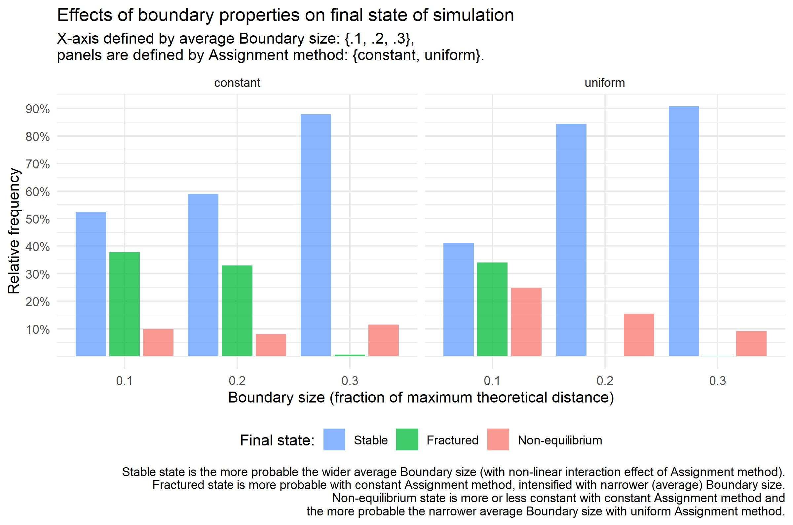
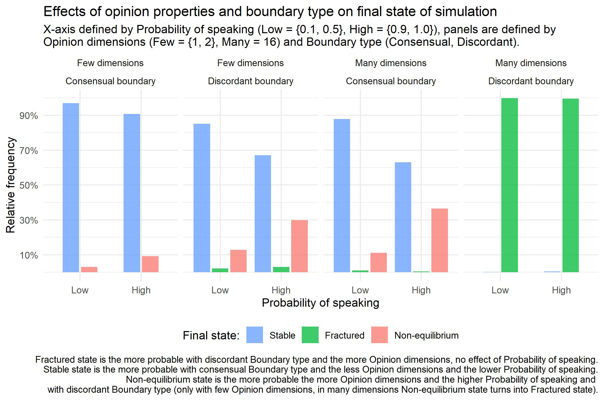
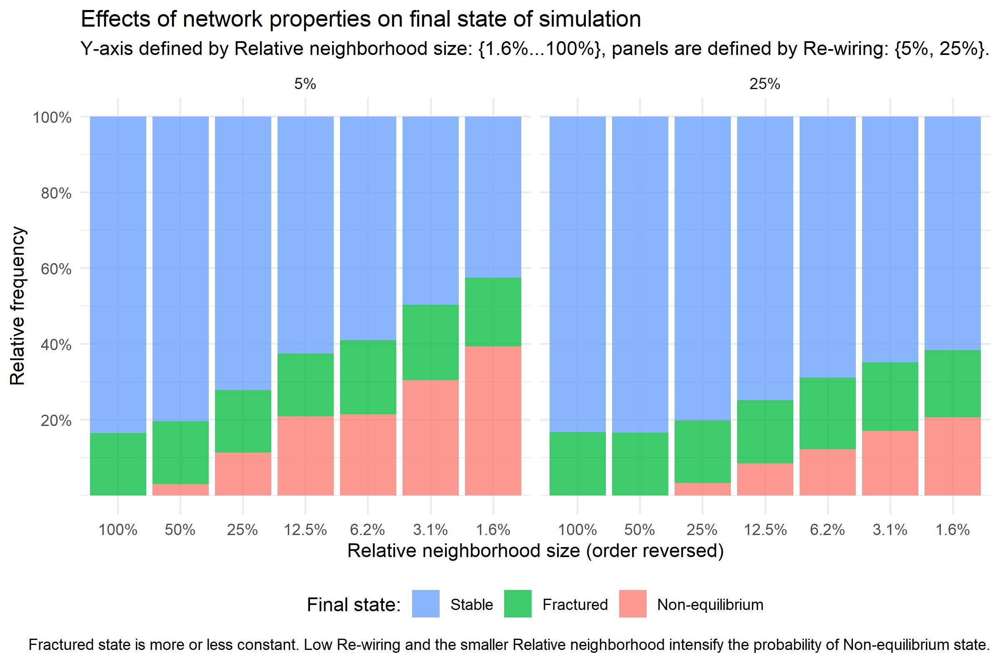
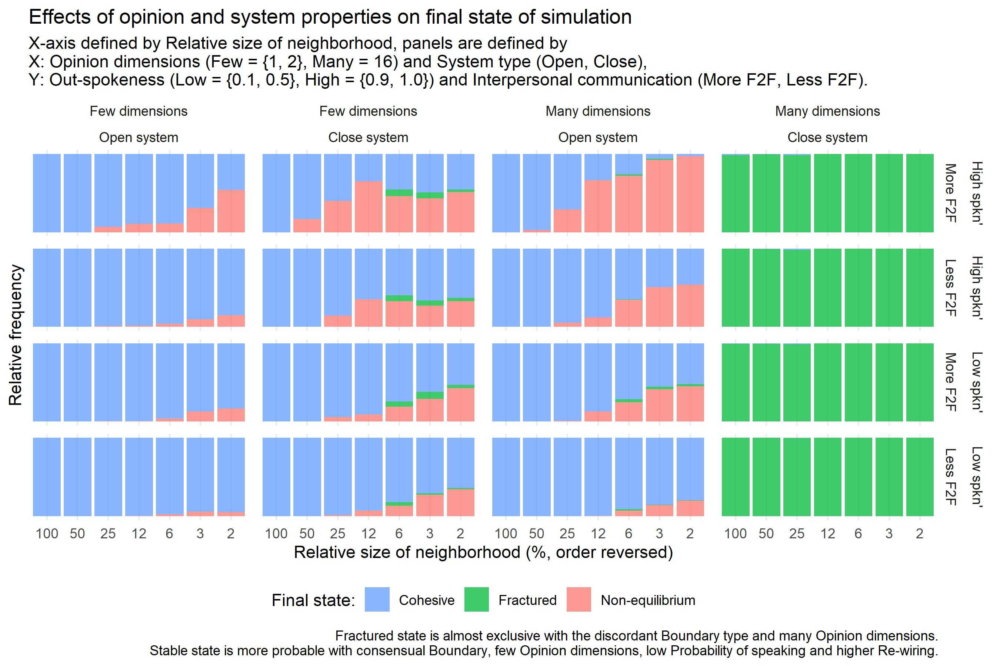

Extended abstract for ICA conference 2022, Paris

Word count:

## Model Description

<To be added later...>

## Main Plots and Comments

Here we see the construction of later used variable `Boundary type`. Originally there were two variables -- `Method of assigning` value of `Uncertainty` and the average `Boundary size`. But these six combinations collapses into two ideal types, the first we coin `Consensual` (very high proportion of `Stable` final states, no `Fractured` state, lower proportion of `Non-equilibrium` states) and the second `Discordant` (lower proportion of `Stable` final states, cca 35% of `Fractured` states, slightly higher proportion of `Non-equilibrium` states). So we constructed  variable `Boundary type` with those two mentioned categories.  

It's not that much surprising that bigger `Boundary size` leads to `Consensual` state. With wider boundary the agents updating opinion see more other agents, updates accordingly and also these agents see updating agent when they update themselves. So the wider boundaries logically lead to `Stable` state with at least one component bigger than 5 agents. 

But how does method of assigning matter? Constant method means that Uncertainty of every agent in the simulation is set on exactly same value (.1, .2, .3), while Uniform method means that for whole simulation there is same average and each agent randomly draws his Uncertainty value from uniform interval <0; 2 * average>. Then in constant method, when agent A doesn't see agent B also agent B doesn't see agent A and there is no chance that they updated to common value, but in Uniform method there is still chance that an agent from pair sees another and then at least seeing agent updates, by updating comes closer and in the and both of them might reach common value. So the Uniform method produces 'super-open' agents driving the opinion dynamics -- they tune to the others and then become bridges among fractions that slowly updates also to these bridging agents and then slowly to each others. So the Uniform method produces these bridging agents and that is why more often Uniform method ends with Stable final state of simulation. Differently speaking, in condition of **Discordant boundary** there is no agent with Uncertainty higher than 0.2/20% (in case of Constant method it's obvious, in case of Uniform the average equal to 0.1 means the agents have Uncertainty in interval <0; 0.2>), while in condition of **Consensual boundary** there are at least some agents with Uncertainty 0.3 or higher.

The real world insight here is crucial role of open-minded people in public debate. If we have enough of them, then we might arrive into conclusive and consensual state, because we have enough bridges to connect otherwise isolated opinion isles. Result also tells us that it is not needed to have every agent, every citizen open-minded, we just need some critical fraction, this fraction ensures enough channels for mediation of opinions of others. But we are not able to say from our present results, what's the value of such an critical fraction at least in our model. There is probably also phase transition from Discordant to Consensual boundary, but from present rough sequences of parameters we are not able to estimate them.    

  

While not effect of highest magnitude, but the most surprising is the support of **low frequency of public speaking** on the higher probability of **Stable final state of simulation**. This result is truly paradoxical -- surprising, but deeply logical. We might see that main transfer of states is from **Stable** to **Non-equilibrium** and *vice versa*. So the result means that the more agents publicly speak their opinion, the more probable simulation doesn't reach equilibrium in 5000 steps. If agents (almost) constantly speak they (almost) constantly report their updates, usualy small changes. Population of agents then in condition of (almost) constant speaking has to constantly update and it's probable that process doesn't end in 5000 steps. When agents speak only sometimes, that means they update more frequently than speak (agents update every step regardless the probability of speaking their opinion out), so they faster reach the consensus. Process is intensified when few agents form seed of the future component/cluster -- then there is still some agent speaking out the position of such a seed and the silent agents invisibly tune to this position and move under a cloak of silence to this seed and then attract other agents when they later speak out their updated position.   

The highest magnitude has combination of many **Opinion dimensions** (precisely: 16) and **Discordant boundary** (precisely: maximally 20% of theoretical maximum). In this condition it is (almost) always granted **Fractured** final state of simulation. The reason of so widely present **Fractured state** is combination of high dimensional space and narrow boundaries -- in this combination of conditions agents might very quickly loose contact with agents previously in close proximity, every dimension offers new opportunities where to hide from sight of previously close agents. 

Practically, results tell us that the more **Opinion dimensions** the higher risk of fractured public sphere, especially with combination with not enough open-minded agents/citizens.

We might take degree of random re-wiring as proxy for degree of spatially independent communication. Close neighbors in our simulation resembles family, colleagues and other spatially dependent communication partners. Random links/randomly re-wired links then resembles social network sites and other personal spatially independent communication chanells. Then result is really surprising but again logical -- so, truly paradoxical: the more re-wiring, i.e. proximity independent communication, leads to stable state with higher probability. Another surprising insight is that **Fractured final state** is independent of rendom rewiring, the main transfer is between Stable and Non-equilibrium states. It seems that social network sites, blamed for creation of bubbles are not true reason for the fracturing of public sphere -- at least in our model.

Here we put together all five independent factors influencing the Final state of simulation, i.e. the state of public sphere. We see that **Stable** public sphere is supported when it is defined only by few dimensions, many dimensions fracture public sphere. It is also supported by consensual boundaries, i.e. with existence of open-minded agents serving as bridges connecting isolated opinion isles and reach population consensus. It's also suported -- surprisingly -- by proximity independent communication and again surprisingly by lower communication activity of agents: when agents far more listen than speak their opinion out, the concensus is reached in reasonable time and fracturing is avoided.Finally, degree of connectivity matters -- the higher proportion agent is in contact with, the higher proportion she scans for opinion update, the higher probability of reaching **Stable** final state/ public sphere in reasonable amount of time. The less connection agents on the average have the more probable is that simulation will run still after 5000 steps.   
