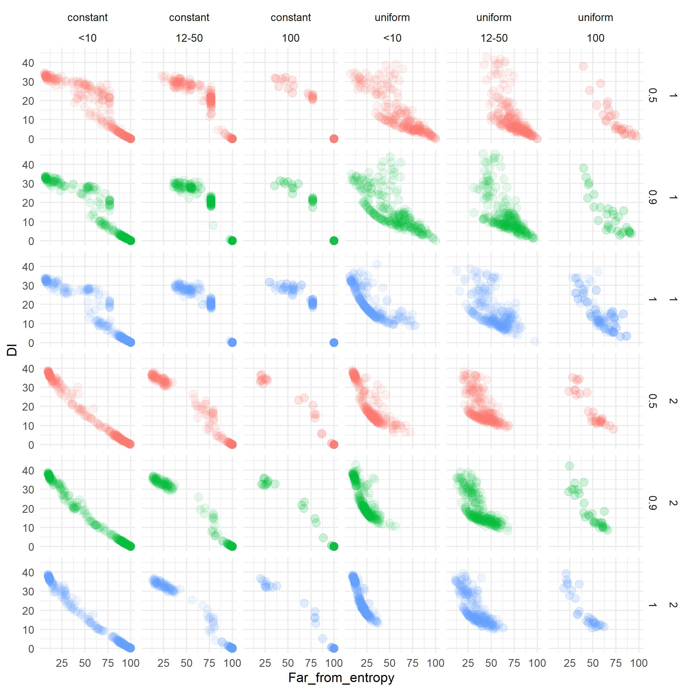

```{r setup, include=FALSE}
knitr::opts_chunk$set(echo = FALSE)
```

## Work in progress...


## Team  


  
***  
  


  
## Hegselmann-Krause (2002) model  

- RQ: How does a group reach a stable state regarding an opinion and how does this consensus look like?
- Agents have an uncertainty level $\epsilon$
- Agents find all other agents with opinion differing not more than $\epsilon$
- Agents then update their opinions to the mean opinion of agents differing not more than $\epsilon$

## Our advancements

- Small-world networks as additional constraint (agents search only their network neighborhood)
- Individual uncertainty level $\epsilon$ (random uniform)
- More dimensions
- Not always speaking (p = .5, .9, 1)

## Results in one picture

***


